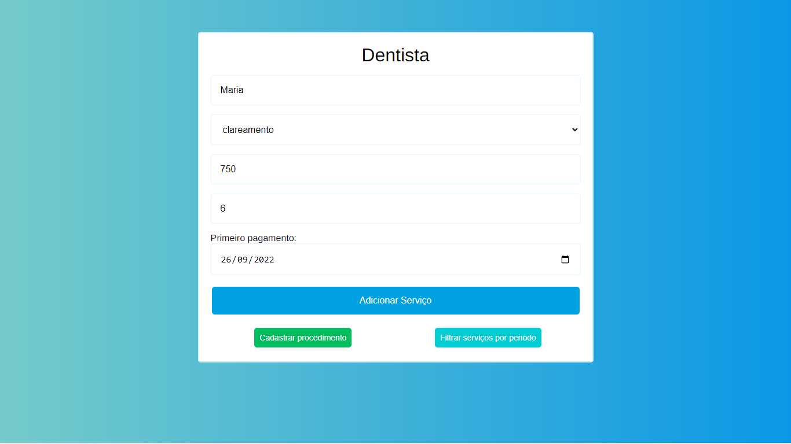
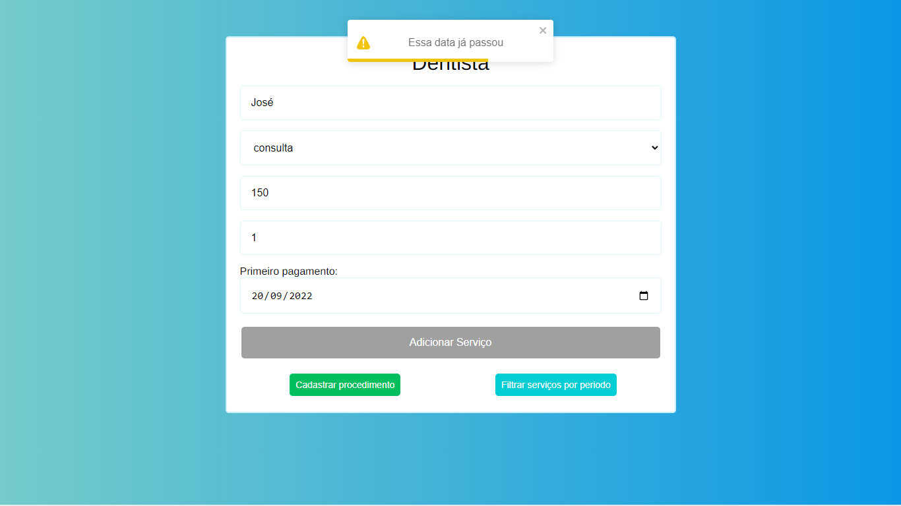
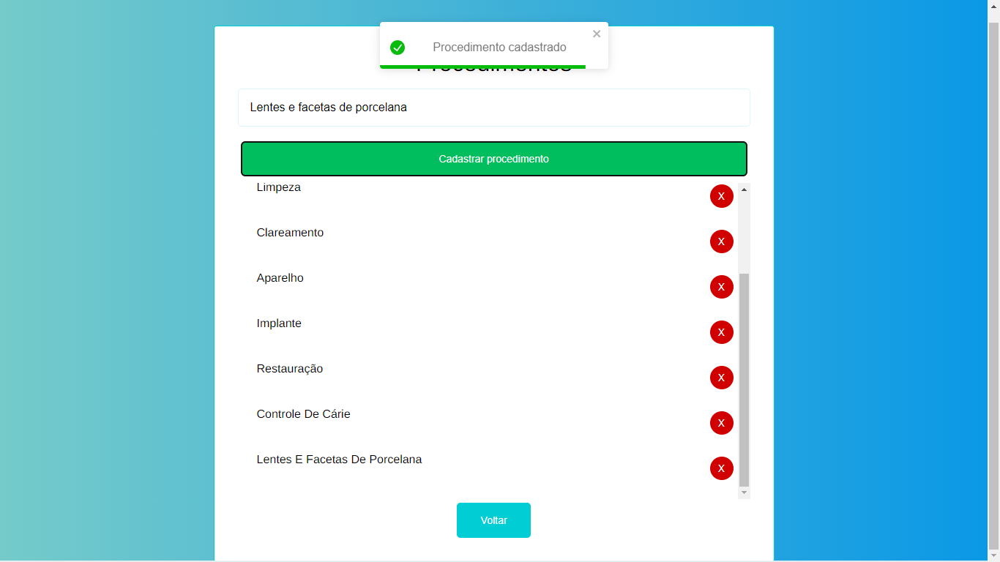
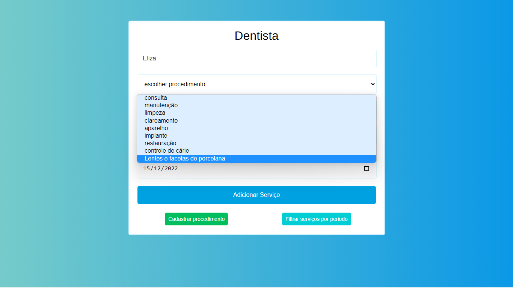
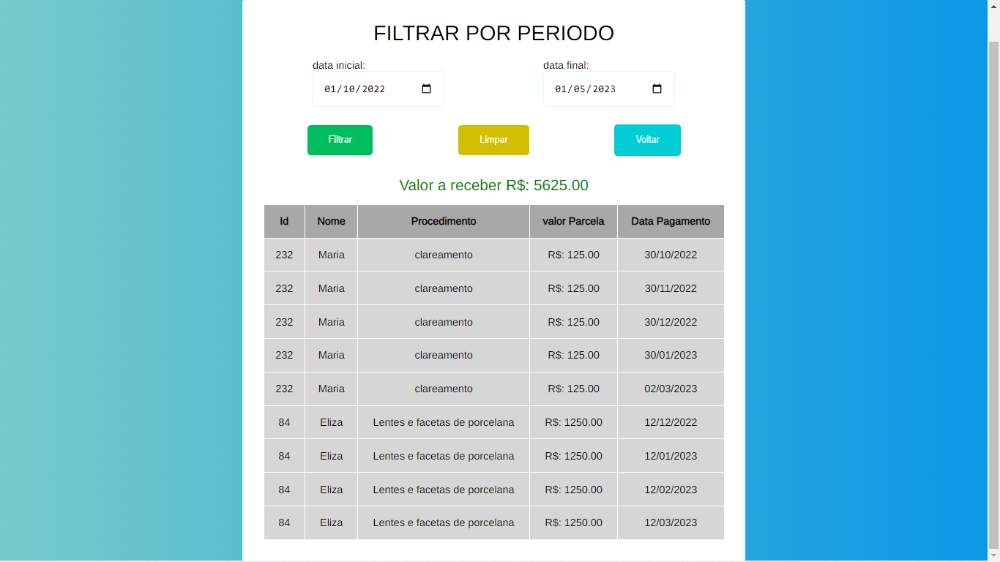

# Boas vindas ao repositório do projeto <strong>dental control</strong> !

<u>[LINK APP](https://dentist-control.herokuapp.com/home)</u>

><h3>🧩 Entenda o problema</h3>
<ul>
  <li>Érica é uma dentista e atende seus pacientes apenas com atendimento particular.</li>
  <li>Como alguns tratamentos dentários são caros e demorados de serem concluídos, o pagamento do tratamento do paciente pode ser parcelado.</li>
  <li>A cada tratamento, ela anota num caderninho quanto e quando cada paciente deve pagar.</li>
  <li>Para Érica saber quanto vai receber num determinado período, ela precisa somar cada valor na calculadora para conseguir esta informação.</li>
  <br>
  <li><h3><strong>A ideia é substituir o caderno de Érica e sua calculadora por uma tela na nuvem ⛅</strong></h3></li>
</ul>

---
<br>

> <h3>👨‍💻 O que foi desenvolvido</h3>
<br>

- Esse projeto foi realizado pensando em atender a necessidade de Érica em gerenciar o controle de pagamentos e também de serviços.
- Sendo assim foi desenvolvido uma tela que permite Érica cadastrar um procedimento odontológico de maneira rápida e fácil.

><h3>✅ Caso de Sucesso </h3>
- Nessa tela podemos ver como exemplo o cadastro de um serviço, que após a validação das informações (```nome```/ ```procedimento```/ ```n° de parcelas```/ ```data do primeiro pagamento```) é habilitado o botão (```Adicionar Serviço```) para que seja realizado o cadastro com sucesso.


---
<br>

><h3>❌ Caso de Exceção </h3>
- Aqui temos um caso de excessao onde as informações foram passadas de maneira incorreta. Pensando nesse caso foi desenvolvido validações para cada campo de entrada (```input```). E caso esse campo não seja valido Érica receba uma notificação referente a essa informação inválida e o botão para cadastro de serviço permace desabilitado.


---
<br>

><h3>🆕 Cadastro de Novo Procedimento </h3>
- Na tela inicial, no canto inferior esquerdo é disponibilizado um botão que redirecionar Érica a tela de cadastro de procedimento abaixo.


- Ao cadastrar um novo procedimento, ele estará disponivel no página principal para ser utilizado para cadastrar um serviço desse novo procedimento.


---
<br>

><h3>📅 Filtro por Período </h3>
- Após cadastrar os serviços, na página principal no canto inferior direito, Érica poderá ter acesso ao valor total que será recebido em sua clínica em um determinado período de tempo, ou seja, através de um filtro de uma data específica ela poderá  ter acesso a uma tabela com diversas informações, como valor total que será recebido nesse período, quais procedimentos, valores mensais de cada procedimento e quais pacientes.


---
<br>

<details>
  <summary>
    <strong>👷 Estruturação do projeto</strong>
  </summary><br>

  - O projeto foi desenvolvido com o ecossistema mais moderno do ReactJS
  - Essa aplicação conta com validações de informações;
  - Sendo possível adicionar um novo serviço;
  - Adicionar um serviço com controle de pagamentos;
  - Ter acesso às informações e valores dos serviços cadastrados de um intervalo de tempo.
</details>

---

<details>
  <summary>
    <strong>🎨 Componentização</strong>
  </summary><br>

  - Esse projeto possui um conjunto de componentes base. Isso foi desenvolvido para que com a componentização do app seja possível fazer o maior reaproveitamento possível de cada estrutura.

</details>

---
